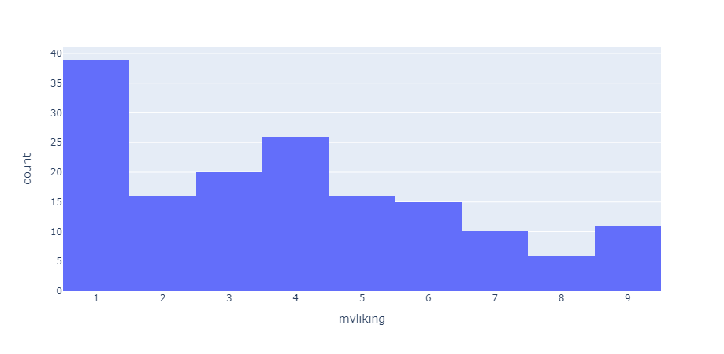
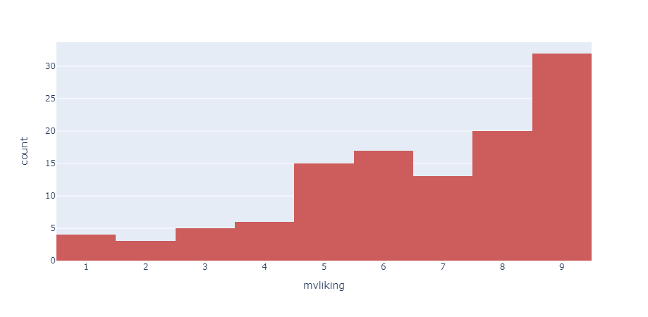
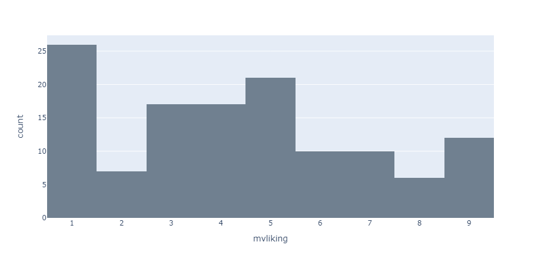
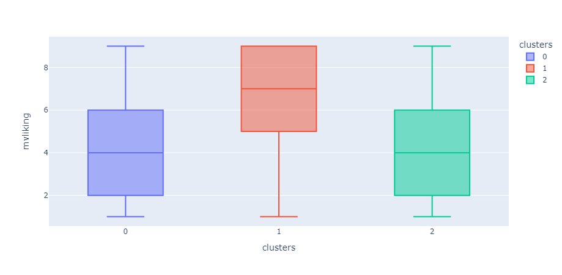
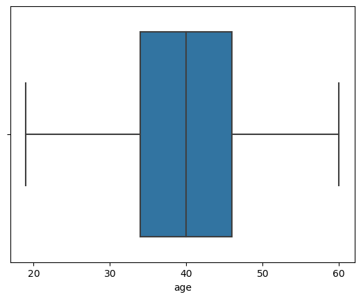
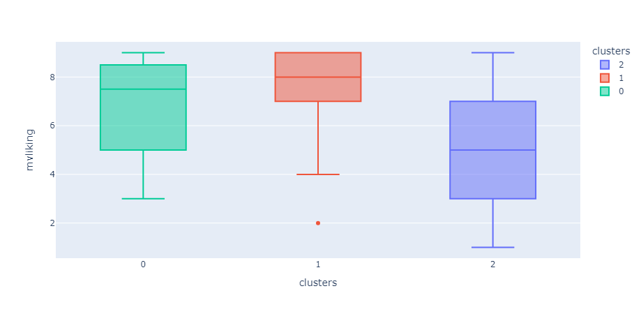

# Reconhecimento de público alvo com PCA e Kmeans

## <a> Motivação </a>

Sendo o PCA e o Kmeans duas ferramentas muito úteis na vida real, a análise de componmentes principais tem muitas aplicações práticas que podem ser utilizadas em praticamente qualquer empresa/organização.

Uma das principais aplicações é na segmentação de clientes, usuários, fornecedores, etc. Imagine uma empresa que queira lançar um novo produto e realiza uma pesquisa para entender melhor as necessidades/desejos dos clientes a fim de direcionar as campanhas de marketing para o lançamento. 

Esses questionários com dezenas ou até centenas de respostas são difíceis de analisar para agrupar os segmentos semelhantes. O PCA ajuda justamente nesse ponto, reduzir a dimensionalidade das respostas a tais questionários melhoram muito a compreensão e aplicação da análise de aglomerados (clusterização).

## <a> Objeto de Estudo </a>

Para esse estudo vou analisar uma empresa fictícia que está lançando um novo carro, uma espécie de microvan, e queremos conhecer o melhor público para iniciar as campanhas de marketing.

O principal método para detectar tais tendências é a pesquisa primária do consumidor, geralmente começando com grupos focais direcionados e prosseguindo para pesquisas de média e, eventualmente, de grande escala. Essas pesquisas servem a pelo menos dois propósitos: 
- verificar os “desejos e necessidades” de um determinado grupo/nicho de consumidores
- junto com os dados demográficos, tentar avaliar o perfil de quem gostou do conceito de microvan.

As perguntas de negócio que queremos responder são:
- Qual é o segmento alvo para este carro? 
- Quais são os desejos e necessidades deste segmento?

O problema é que, se fizermos uma análise de aglomerados com 30 features, o resultado não será muito inteligível e ficaria difícil de entender os perfis dos clientes. Podemos reduzir a dimensionalidade das features para agrupar as que possuem variância similar (PCA) e então avaliar qual foi o resultado dessa redução em termos de interesses dos clientes. Para avaliar a homegeneidade dos grupos, somente com clusterização, mas já com PCA conseguimos ter a junção de features com variância semelhante, o que, para respostas de questionários, serve como um agrupamento de perfis de respostas.

Assim como nos outros projetos, bancos, telefônicas, varejo, qualquer empresa que presta algum tipo de serviços e possui informações sobre seus clientes pode se beneficiar de análise de questionários de clientes e redução em componentes principais conforme iremos construir nesse projeto.

Esse é um estudo de caso real (Grosse Pointe Associates and The “Microvan”) está disponível no livro "Modern Marketing Research: Concepts, Methods, and Cases" ISBN 1133188966

## <a> Insights </a>
- O cluster 1 possui a maior contagem de possiveis clientes que gostaram do conceito da microvan.
- Não ser economico e gostar de carros grandes (essa dava para imaginar) parecem ser dois fatores muito importantes para gostar da microvan.
- A idade de 40/45 anos tem o maior indice de aprovação do conceito da microvan.
- Homens tem uma preferencia maior pela microvan.
- Numero de filhos não foi um fator tão importante quanto esperava.

**Contplot clusters:**

**Boxplot clusters:**

**Boxplot da idade:**

**Boxplot dos clusters com filtro de idade:**

## <a> Conclusão </a>
As características do cluster 1 combinado com os componentes mais fortes desse aglomerado trazem uma noção muito melhor de quais os tipos de clientes serão foco de uma campanha de marketing. Essa informações combinadas com as demográficas, mostram que o foco deve ser mais ligado ao sexo masculino, com idade acima de 40/45 anos, que querem gastar muito com carro (Economico) e gostam de muito espaço (N_carros_grandes negativo). Caso queiram e tenham possibilidades de um investimento maior é possivel também  é possivel usar os clientes do cluster 0 tambem.

## <a> Estrutura do Projeto </a>
- Data: Contem os arquivos de dados que serão usados para o projeto.
- Notebooks: Contem os notebooks que serão usados para o projeto.
- Reports: Contem as imagens salvas.

## <a> Tecnologias usadas </a>
Linguagem: 
- Python

Libs:
- Gerenciamento de dados: Pandas.
- Visualização de dados:  Matplotlib, seaborn, plotly.
- Clusterização de dados: Scikit-learn.

## <a> Metadados </a>

Que monte de sopa de letras é essa!? Vamos às descrições (também chamado de dicionário de dados).

- subjnumb:  Índice do(a) potencial cliente.
- mvliking: o quanto o(a) potencial cliente gostou do conceito da microvan.
- kidtrans: Precisamos de um carro que ajude a transportar nossos filhos os seus amigos.
- miniboxy: As minivans atuais são simplesmente muito quadradas e grandes.
- lthrbetr: Os assentos de couro são muito melhores que os de tecido.
- secbiggr: Se tivéssemos um segundo carro, precisaria ser maior que um sedã padrão.
- safeimpt: A segurança do automóvel é muito importante para mim.
- buyhghnd: Nós tendemos a comprar carros mais sofisticados.
- pricqual: Os preços dos automóveis refletem fortemente a qualidade de produção subjacente.
- prmsound: Um sistema de som e entretenimento premium ajuda em longas viagens de carro.
- perfimpt: O desempenho é muito importante em um carro.
- tkvacatn: Tentamos tirar o máximo de férias possível.
- noparkrm: Nossa residência atual não tem muito espaço de estacionamento.
- homlrgst: Nossa casa está entre as maiores do bairro.
- envrminr: O impacto ambiental dos automóveis é relativamente pequeno.
- needbetw: Precisa haver algo entre um sedan e uma minivan.
- suvcmpct: Gosto mais de SUVs do que de minivans, pois são mais compactos.
- next2str: Meu próximo carro será um de dois lugares.
- carefmny: Temos cuidado com o dinheiro.
- shdcarpl: Acho que todo mundo deveria pegar carona ou usar transporte público.
- imprtapp: A maioria dos nossos aparelhos são importados.
- lk4whldr: A tração nas quatro rodas é uma opção muito atraente.
- kidsbulk: Nossos filhos tendem a levar muitos itens volumosos e brinquedos com eles.
- wntguzlr: Eu vou comprar o que eu quero mesmo que seja um “bebedor de gás”.
- nordtrps: Não fazemos viagens com a família
- stylclth: Nós tendemos a comprar roupas elegantes para a família.
- strngwrn: A proteção da garantia precisa ser forte em um carro novo.
- passnimp: A paixão pelo trabalho é mais importante do que o pagamento.
- twoincom: Nossa família acharia difícil subsistir com apenas uma renda.
- nohummer: Não estou interessado em possuir um veículo como um Hummer.
- aftrschl: Nós nos envolvemos em mais atividades depois da escola do que a maioria das famílias.
- accesfun: Os acessórios realmente tornam o carro mais divertido de dirigir.

Dados demográficos dos clientes:

- age: Idade do entrevistado em anos
- income: Renda familiar anual em milhares de dólares
- miles: Valor anual total conduzido por membros da família em milhares de milhas
- numkids: Número de crianças (0-18 anos) que residem no domicílio
- female: Se o entrevistado é ou não uma mulher
- educ: Nível de escolaridade do entrevistado (1 = Ensino médio, 2 = Alguma faculdade, 3 = Graduação, 4 = Pós-graduação)
- recycle: Reciclagem autorrelatada em comparação com a média (1 = Muito menos, 2 = Um pouco menos, 3 = Médio, 4 = Um pouco mais, 5 = Muito mais)

